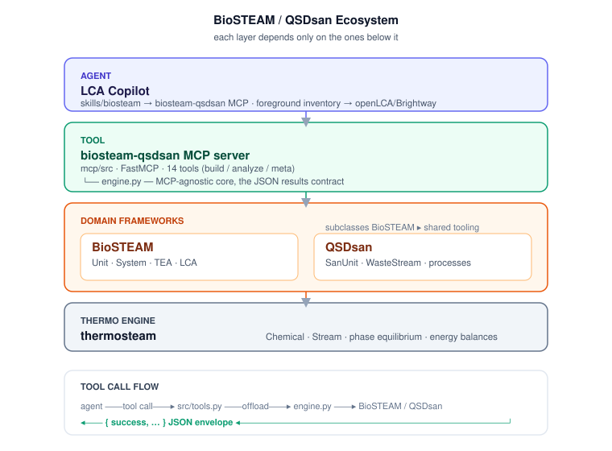

# Architecture

How the pieces of the BioSTEAM/QSDsan ecosystem fit together, and why.



## The stack, bottom to top

```
 ┌─────────────────────────────────────────────────────────────┐
 │  LCA Copilot   (skills/biosteam → biosteam-qsdsan MCP)       │  agent layer
 ├─────────────────────────────────────────────────────────────┤
 │  biosteam-qsdsan MCP server  (mcp/src, FastMCP, 14 tools)    │  tool layer
 │     └── engine.py  (MCP-agnostic core, the results contract) │
 ├─────────────────────────────────────────────────────────────┤
 │  QSDsan   (SanUnit, WasteStream, dynamic processes)          │  domain frameworks
 │  biorefineries  (published BioSTEAM models)                  │
 │  BioSTEAM   (Unit, System, TEA, LCA)                         │
 │  thermosteam   (Chemical, Stream, equilibrium)               │  thermo engine
 └─────────────────────────────────────────────────────────────┘
```

Each layer only depends on the ones below it. thermosteam is the thermodynamic engine;
BioSTEAM adds process units, systems, TEA, and LCA; QSDsan specializes BioSTEAM for
sanitation. The MCP server exposes all of it as tools; the LCA Copilot consumes those
tools through a skill.

## Repository map

```
Biosteam/
├── tutorials/        9 tiers, beginner→expert (concept .md + runnable .py + executed .ipynb)
├── case_studies/     5 end-to-end studies with reproducible headline numbers
├── reference/        cheat-sheet, glossary, troubleshooting (version gotchas)
├── environment/      env setup, requirements, verify + notebook-build tooling
├── docs/             this documentation set
└── mcp/              the MCP server
    ├── engine.py     framework-facing core (the results contract)
    └── src/          FastMCP server wrapping the engine
```

## The results contract

The design keystone is **one framework-agnostic results contract** (introduced in
tutorial Tier 8, implemented in `mcp/engine.py`). A system — whether a toy flowsheet, a
published biorefinery, or a QSDsan sanitation train — is summarized into a plain,
JSON-friendly dict. Because `qsdsan.System`/`TEA`/`Model` subclass their BioSTEAM
counterparts, the same code path serves every framework.

This split is deliberate:

- **`engine.py`** holds all process-modeling logic and returns `{success, ...}` dicts.
  It has no MCP dependency, so it is unit-testable without a live client.
- **`src/`** (the FastMCP server) is a thin adapter: it stores built systems under a
  `result_id`, decorates the engine methods as tools with strict output schemas, and
  offloads blocking simulations to worker threads.

```
 agent ──tool call──▶ src/tools.py ──offload──▶ engine.py ──▶ BioSTEAM/QSDsan
   ◀──── {success,…} envelope ◀──────────────────┘
```

## State model

The server is stateful by `result_id`. `build_*` tools construct and register a system;
analysis tools look it up and read results off the live objects (no recomputation);
`dispose_result` frees it. `run_uncertainty` additionally stores its `Model` on the
entry so `run_sensitivity` can read the Spearman correlations without re-sampling.

## The LCA seam (foreground ↔ background)

BioSTEAM/QSDsan compute the **foreground** inventory (the process you model). The
**background** — grid electricity, chemical production, transport — comes from database
ecosystems (openLCA, Brightway). `get_lca_results` takes background characterization
factors (`cfs`) and applies them to the foreground inventory. The
[cross-framework LCA case study](../case_studies/cross_framework_lca/) proves the
BioSTEAM aggregation and an independent inventory×CF calculation reconcile exactly, so
the inventory is portable. This is exactly where the biosteam MCP couples to the
existing openLCA/Brightway skills in the LCA Copilot.

## Naming note (why the package is `src`, not `mcp`)

The server folder is `mcp/`, which would shadow the `mcp` SDK package on import. So the
Python package is named **`src`** (mirroring the sibling `openlca_mcp` server), and
`src/app.py` inserts `mcp/` onto `sys.path` so the sibling `engine.py` resolves. Launch
the server from the `mcp/` directory (`python -m src`). See
[getting-started](getting-started.md).
